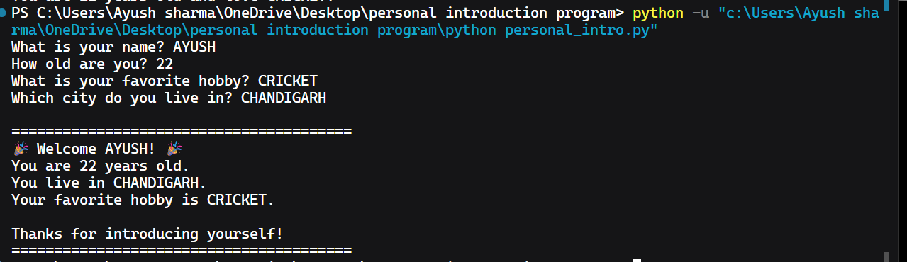

# 👋 Personal Introduction Program

A beginner-friendly Python project that collects user information and displays a personalized welcome message. This project demonstrates the use of Python fundamentals such as user input, variables, output formatting, and f-strings.

---

## 📖 Project Overview

The Personal Introduction Program is a simple command-line Python application that interacts with users by asking for personal information and then generating a friendly, customized welcome message.

This project was created to practice basic Python programming concepts and understand how user interaction works in console applications.

---

## 🎯 Project Objectives

* Learn how to use the `input()` function.
* Store user responses in variables.
* Display information using the `print()` function.
* Format output using Python f-strings.
* Build a simple interactive console application.
* Practice project organization and GitHub workflow.

---

## ✨ Features

* Collects user information interactively.
* Uses multiple input fields.
* Displays a personalized welcome message.
* Beginner-friendly and easy to understand.
* Well-documented project structure.

---

## 🛠 Technologies Used

* Python 3

No external libraries or frameworks were required.

---

## 📂 Project Structure

```text
TASK-1-Personal-Introduction-Program/
│
├── personal_intro.py
├── README.md
├── requirements.txt
└── screenshot.png
```

### File Description

| File              | Purpose                         |
| ----------------- | ------------------------------- |
| personal_intro.py | Main Python program             |
| README.md         | Project documentation           |
| requirements.txt  | Project dependencies            |
| screenshot.png    | Screenshot of program execution |

---

## ⚙️ Setup and Installation Instructions

### 1. Clone the Repository

```bash
git clone https://github.com/ayushsankhyan/TASK-1-Personal-Introduction-Program.git
```

### 2. Navigate to the Project Directory

```bash
cd TASK-1-Personal-Introduction-Program
```

### 3. Run the Program

```bash
python personal_intro.py
```

---

## 🚀 How the Program Works

1. The program asks the user for:

   * Name
   * Age
   * Favorite Hobby
   * City

2. The responses are stored in variables.

3. A personalized welcome message is displayed using f-strings.

---

## 💻 Sample Output

```text
What is your name? Ayush
How old are you? 22
What is your favorite hobby? AI Development
Which city do you live in? Amb

========================================

🎉 Welcome Ayush! 🎉

You are 22 years old.
You live in Amb.
Your favorite hobby is AI Development.

Thanks for introducing yourself!

========================================
```

---

## 📸 Screenshot

### Program Execution



---

## 🏗 Code Structure Explanation

The application follows a simple structure:

### User Input

```python
name = input("What is your name? ")
age = input("How old are you? ")
hobby = input("What is your favorite hobby? ")
city = input("Which city do you live in? ")
```

Collects information from the user and stores it in variables.

### Output Generation

```python
print(f"🎉 Welcome {name}! 🎉")
```

Uses f-strings to create a personalized welcome message.

---

## 🔍 Technical Details

### Algorithm

1. Ask the user for personal information.
2. Store responses in variables.
3. Generate a personalized welcome message.
4. Display the information back to the user.

### Data Structures Used

* String variables

### Application Architecture

```text
User Input
     ↓
Store in Variables
     ↓
Process Data
     ↓
Display Welcome Message
```

---

## ✅ Technical Requirements Fulfilled

| Requirement              | Implementation                                 |
| ------------------------ | ---------------------------------------------- |
| Use input()              | Collected user information using input()       |
| Use variables            | Stored name, age, hobby, and city in variables |
| Use print()              | Displayed personalized welcome message         |
| Add at least 3 questions | Asked 4 questions                              |
| Friendly output          | Used emojis and personalized greetings         |
| Use f-strings            | Implemented formatted output using f-strings   |

---

## 🧪 Testing Evidence

### Test Case 1

**Input**

```text
Name: Ayush
Age: 22
Hobby: AI Development
City: Amb
```

**Expected Result**

```text
Welcome Ayush!
```

**Status:** Passed ✅

---

### Test Case 2

**Input**

```text
Name: Alex
Age: 21
Hobby: Coding
City: Delhi
```

**Expected Result**

```text
Welcome Alex!
```

**Status:** Passed ✅

---

## 📚 What I Learned

Through this project, I learned how to:

* Use Python's `input()` function to collect information from users.
* Store data using variables.
* Display output using the `print()` function.
* Format text dynamically using f-strings.
* Build a simple interactive Python application.
* Organize project files professionally.
* Use Git and GitHub for version control and project hosting.
* Create clear technical documentation using Markdown.

---

## 🎓 Conclusion

This project successfully demonstrates the fundamentals of Python programming by combining user interaction, variables, input/output operations, and formatted strings into a simple yet practical application. It serves as a strong foundation for learning more advanced Python concepts and software development practices.
